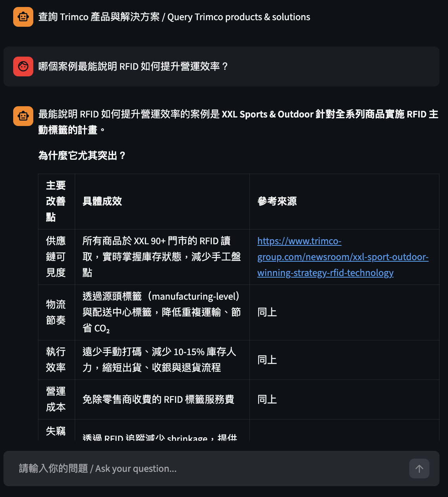
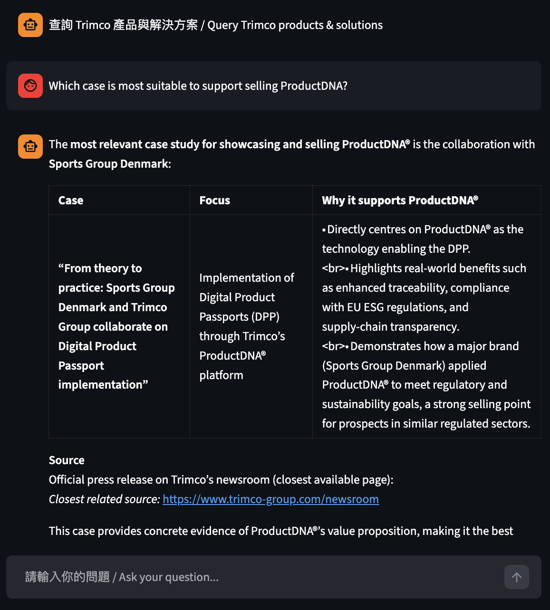

# Trimco Solutions Assistant

A lightweight AI assistant designed to turn Trimco’s public website content into a usable sales and solution support tool.

This prototype demonstrates how static content can be transformed into a queryable knowledge resource using a Retrieval-Augmented Generation (RAG) approach.

**Live Demo:** https://trimco-solutions-assistant-nmw83vmfg5sguk5vrfdbz3.streamlit.app/

## Screenshot

  
  

## Use Case

This assistant is designed as a Sales / Solutions Assistant to make Trimco’s knowledge more accessible and usable.

Instead of navigating multiple pages across https://www.trimco-group.com/, users can:

- Query products and solutions directly  
- Retrieve relevant customer cases  
- Generate sales talking points grounded in real examples  

This reflects a practical application of AI to support internal workflows, rather than applying AI for its own sake.

## Example Queries
- 哪個案例最能說明 RFID 如何提升營運效率？
- 比較 Bergans 與 Sports Group Denmark 在 DPP 上的做法
- Which case is most suitable to support selling ProductDNA?
- Based on cases, generate 3 sales talking points with examples

## Approach

- Extracted and structured content from Trimco’s website  
- Built a Retrieval-Augmented Generation (RAG) pipeline  
- Hosted knowledge base, embeddings, and agent on DigitalOcean  
- Exposed via a simple chat interface for internal use  

## Assistant Behavior Design

To better support real usage, the assistant was configured with a few key behaviors:

- Source transparency  
  Responses include relevant source URLs so users can verify and explore further  

- Bilingual response handling  
  The assistant adapts to the user’s language (繁體中文 / English)  

- Business-focused responses  
  Answers focus on solutions, use cases, and practical applications rather than generic descriptions  

## What this demonstrates

- A practical approach to turning unstructured content into usable knowledge  
- How AI can support real business workflows  
- Rapid prototyping of domain-specific assistants using RAG  

## Cost Consideration

- Model: OpenAI GPT-oss-20b  
  - Input: $0.05 / 1M tokens  
  - Output: $0.45 / 1M tokens  

- Typical usage per query:  
  - ~7K input tokens, ~100–200 output tokens  
  - Estimated cost: **~$0.0004 per request**

- Dataset and embedding:  
  - Source: ~3MB website content (~300K–500K tokens)  
  - Embedded size: ~80–100MB  
  - Embedding model: GTE Large EN v1.5 ($0.09 / 1M tokens)  
  - One-time indexing cost: **~$0.02–0.05**

- Infrastructure (DigitalOcean DB):  
  - 1 vCPU / 2GB RAM / 40GB disk  
  - Cost: **~$20/month**

**Summary:**  
Fixed cost is mainly infrastructure (~$20/month), while inference cost per query is minimal and scales with usage.

## Notes

- This is a prototype built for demonstration purposes  
- Content is based on publicly available website data  